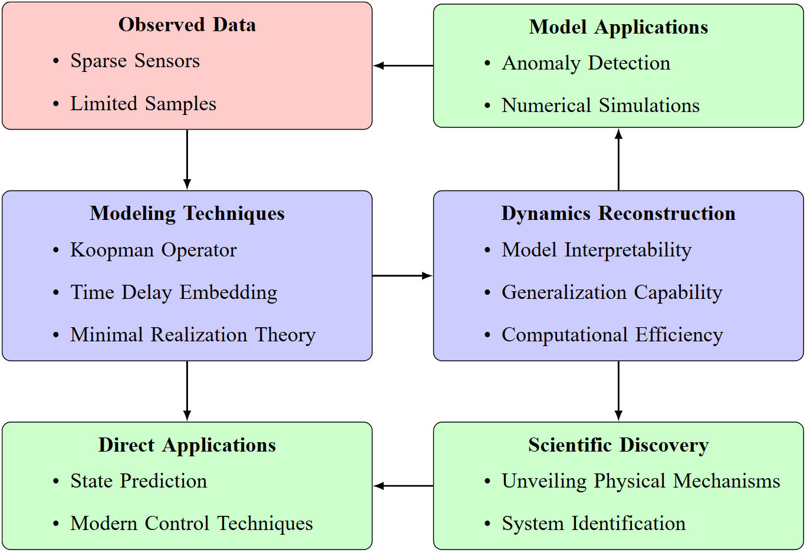

# Minimal Realization Time-Delay Koopman Analysis for Nonlinear System Identification
**Code for preprint paper** "Minimal Realization Time-Delay Koopman Analysis for Nonlinear System Identification"  
---

### Paper Abstract
Data is increasingly abundant in fields such as biology, engineering, neuroscience, and epidemiology. However, developing accurate models that capture the dynamics of the underlying system while ensuring interpretability and generalizability remains a significant challenge. To address this, we propose a novel methodology called Minimal Realization Time-Delay Koopman (MRTK) analysis, which is capable of identifying the minimal degrees of freedom in linear systems and handling both full-state and sparse measurements, even in noisy environments. For full-state measurements, we demonstrate that MRTK is equivalent to the Dynamic Mode Decomposition (DMD) method. For sparse measurements, it employs time-delay embedding techniques and the Koopman operator to construct a minimal realization linear model that is diffeomorphic to the attractor of the original system, unveiling the system's physical dynamics from a differential topology perspective. We validate the proposed approach using simulated data from transitional channel flow and the Lorenz system, as well as real-world temperature and wind speed data from the Hangzhou Bay Bridge. Integrating the identified model with a Kalman filter enables accurate estimation and prediction of sparse data. The results demonstrate high predictive accuracy in both scenarios, with the maximum NMSE prediction error for the wind speed field at 1.911%, highlighting the advanced identification capacity of the method and its potential to advance prediction and control of complex systems.

<div style="text-align: center;">
  
</div>


### Introduction

The paper is available on Research Square at the following link: [Research Square Paper](https://www.researchsquare.com/article/rs-6029043/v1). In this work, we propose a novel methodology called **Minimal Realization Time-Delay Koopman (MRTK) Analysis**, designed to identify the minimal degrees of freedom in linear systems. MRTK can handle both full-state and sparse measurements, even in noisy environments, making it highly suitable for complex systems across various domains such as biology, engineering, neuroscience, and epidemiology.

The validation in the paper primarily comes from the fluid dynamics simulation data of transitional channel flow generously shared by Professor Benjamin Herrmann, our own generated Lorenz system data, and real-world temperature and wind speed data from the structural health monitoring system of the Hangzhou Bay Bridge.The specific implementation of the transitional channel flow can be found in the paper ([Data-driven Resolvent Analysis](https://www.cambridge.org/core/journals/journal-of-fluid-mechanics/article/datadriven-resolvent-analysis/0FA58F03E774C7402EA188D3B8F34B0F)).  Due to the monitoring data being available from the government, restrictions apply to the availability of these data under license for the current study, meaning they are not publicly accessible.  


Therefore, as a public MRTK method repository, we only provide the implementation of the MRTK method based on the Lorenz system data here. We believe this is sufficient for users to understand and apply the MRTK algorithm.

---

Since I have already stored the related data and models, each script can be run independently. The `MRTK_Algorithm.py` provided here is an example of applying the MRTK algorithm to Lorenz system data. However, as a user, you can run `MRTK_Algorithm.py` and replace the loaded data with your own dataset to test whether MRTK works for your specific data.

Required libraries:
```python
import numpy as np
import matplotlib.pyplot as plt
from scipy.linalg import logm
import os
```

If you wish to reproduce the Lorenz system case shown in the MRTK paper, first run `Lorenz_simulation.py` to generate simulated data.  
Required libraries:
```python
import numpy as np
import matplotlib.pyplot as plt
from scipy.integrate import solve_ivp
```

Then, based on the simulated data, you can use `MRTK_Algorithm.py` to generate the MRTK model, and finally run `Lorenz_model.py` in combination with the Kalman filter for prediction.  
Required libraries:
```python
import numpy as np
import pandas as pd
np.random.seed(0)
from scipy.io import loadmat
import matplotlib.pyplot as plt
import matplotlib as mpl
import seaborn as sns
from scipy.signal import welch
```

### Code Description

- **Lorenz_simulation.py**: Generates the Lorenz system data used in the paper and saves it as `Lorenz_data.npy`.
- **MRTK_Algorithm.py**: As an example, constructs the corresponding Minimal Realization Time-Delay Koopman-Analysis model based on the generated Lorenz system data and saves the matrices `Lorenz_A_DMD.npy` and `Lorenz_C.npy`.
- **Lorenz_model.py**: Runs the model with `Lorenz_A_DMD.npy` and `Lorenz_C.npy`, integrating a Kalman filter for prediction.
